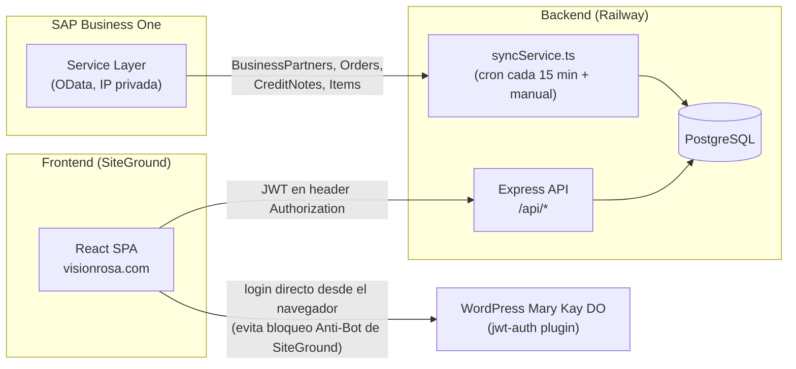
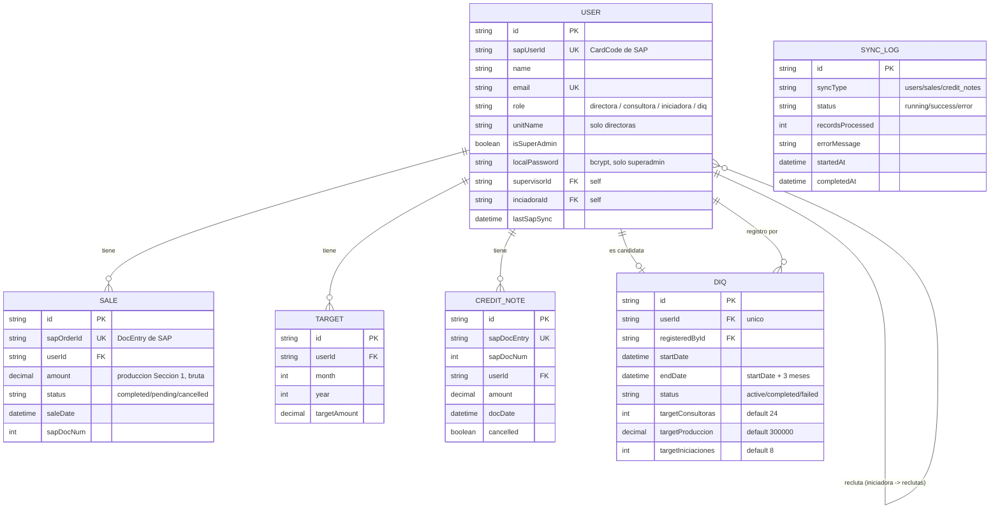

# Mary Kay Commissions Dashboard — Documentación técnica del proyecto

> Última actualización: 14 de julio de 2026.
> Este documento es para onboarding de desarrolladores. Para las reglas de negocio detalladas de comisiones, ver `CLAUDE.md` en la raíz del proyecto (sección "ESTRUCTURA DE COMISIONES").

## 1. Qué es esto

Dashboard donde las Directoras y Consultoras de Mary Kay República Dominicana (unidad Aroma del Rosal) ven sus ventas, las de su equipo, avance de metas, comisiones estimadas y, para el Super Admin, herramientas de gestión (sincronización con SAP, asignación de metas, seguimiento de candidatas a Directora).

Los datos de ventas y usuarios vienen 100% de **SAP Business One** (vía Service Layer) y se sincronizan a una base de datos PostgreSQL propia para que el dashboard sea rápido.

## 2. Stack tecnológico (versiones reales instaladas)

### Frontend (`/frontend`)
- React 18.2 + TypeScript 5.6
- Vite 5.4 (build tool)
- React Router 6.28
- TailwindCSS 3.4
- Zustand 4.5 (estado global — auth)
- Axios 1.7
- Recharts 2.13 (gráficos)
- date-fns 4.1
- `xlsx` 0.18 (dependencia instalada, pero el botón de exportar a Excel fue removido de la UI en julio 2026 — revisar si aún se usa en otro lado antes de quitarla)

### Backend (`/backend`)
- Node.js + Express 4.21 + TypeScript 5.6
- Prisma ORM 5.22 sobre PostgreSQL
- `ts-node-dev` para desarrollo (auto-restart en cambios — pero ver sección "Gotchas" sobre cuándo NO reinicia solo)
- `jsonwebtoken` 9.x (validación de JWT)
- `bcrypt` 6.x (passwords locales de superadmin)
- `axios` (cliente HTTP hacia SAP Service Layer, con reintentos custom)
- `node-cron` (instalado, para jobs programados — confirmar si está activo)

### Infraestructura
- **Backend + Postgres:** Railway (deploy manual vía `railway up`, no conectado a git)
- **Frontend:** SiteGround, hosting estático — dominio real de producción: **visionrosa.com** (no `comisiones.marykay.do` como dice el nombre original en `CLAUDE.md`, eso quedó desactualizado)
- **SAP:** Business One Service Layer, IP privada con certificado self-signed, compañía `SBO_AROMADELROSAL`

## 3. Arquitectura general



**Por qué el login a WordPress se hace desde el navegador y no desde el backend:** SiteGround tiene un Anti-Bot AI que bloquea peticiones POST servidor-a-servidor hacia el endpoint de WordPress (las detecta como tráfico de bot, no de usuario real). La solución fue mover esa llamada específica al navegador del cliente, que si parece tráfico humano normal. El resto de la autenticación (validar el JWT resultante, password local de superadmin) sigue en el backend.

## 4. Estructura de carpetas

```
backend/src/
  routes/          auth, dashboard, sales, admin, commissions, superadmin, profile, diq
  services/        syncService (motor de sync SAP→DB), sapService (cliente SAP tipado),
                    commissionService
  middleware/      auth (JWT), errorHandler
  utils/           sapClient (axios + reintentos + sesión SAP), constants (flags de negocio),
                    logger, prisma
  prisma/          schema.prisma, migrations/
  scripts/         scripts de diagnóstico ad-hoc (ver sección 9)

frontend/src/
  pages/           DashboardPage, SalesPage, ConsultorasPage, MetasPage, ComisionesPage,
                    PerfilPage, DIQPage, AdminPage, SuperAdminPage
  components/
    Layout/        Layout, Header, Sidebar (con drawer móvil)
    Dashboard/     OverviewCard, SalesChart, ProductionChart, SubordinatesTable, GoalThermometer
    Sales/         SalesDetailModal
    Auth/          LoginPage
    Common/        LoadingSpinner, ErrorAlert
  store/           authStore (zustand)
  utils/           api.ts (axios + interceptor de token)
```

## 5. Modelo de datos (Prisma / PostgreSQL)



Notas sobre el modelo:
- `User.supervisorId` = jerarquía de **unidad** (GroupCode de SAP → consultoras de una directora). Se asigna automático en cada sync.
- `User.inciadoraId` = jerarquía de **reclutamiento personal** (`U_CodIni` de SAP), independiente de la unidad. Una directora puede reclutar gente fuera de su propia unidad.
- `User.role` se calcula en cada sync: `directora` (si `U_Tipo='D'` o aparece como responsable de un grupo) > `diq` (si fue reclutada por alguien Y tiene `U_DIQ='S'` en SAP) > `iniciadora` (si reclutó al menos a una persona) > `consultora`.
- No hay tabla de "Comisiones" — se calculan al vuelo en `commissionService.ts` a partir de `Sale`/`CreditNote`, no se persisten.

## 6. Integración con SAP — cómo funciona el sync

Motor: `backend/src/services/syncService.ts`, cliente HTTP: `backend/src/utils/sapClient.ts`.

- **Sesión SAP:** login vía `/Login`, sesión válida ~28 min, se renueva sola.
- **Reintentos:** hasta 6 intentos con backoff creciente (1.5s, 3s, 4.5s...) para errores de red (`ECONNRESET`, `ETIMEDOUT`, etc). El servidor SAP (IP privada, puerto 50000) es inestable — esto es esperado, no un bug del código.
- **Tres sync independientes**, cada uno loguea en `SyncLog`:
  - `syncUsers()` — trae `BusinessPartners` + `BusinessPartnerGroups`, calcula roles, asigna `supervisorId`/`inciadoraId`, auto-crea registros `DIQ` para candidatas marcadas en SAP.
  - `syncSales()` — trae `Orders` (paginado de 50 en 50 porque cada orden trae sus líneas de detalle, lo cual es pesado) y calcula `Sale.amount` (ver regla de "Sección 1" abajo).
  - `syncCreditNotes()` — trae `CreditNotes`, se restan de la producción en los reportes.
- `fullSync()` corre los tres en secuencia. Se dispara manual desde el SuperAdmin (tab Sync) o programado.

### Regla de negocio: qué cuenta como "producción" (`Sale.amount`)

**Confirmado con el equipo de SAP el 13-14 de julio de 2026 y validado al centavo contra el reporte oficial "Comisión Por Producción De Unidad".**

Un artículo cuenta como producción real **solo si pertenece a "Sección 1"** — esto es la tabla `OITM` de SAP, campo `QryGroup1 = 'Y'` (expuesto por el Service Layer como `Properties1 = 'tYES'` en el JSON de `/Items`). Los artículos de "Sección 2" (kits de inicio, bolsas, catálogos, tickets de venta/graduación, etc.) **no cuentan**, sin importar si tuvieron descuento aplicado en la orden.

Fórmula: `Sale.amount = suma(LineTotal de líneas Sección 1) × 1.18` (el 1.18 reincorpora el ITBIS, porque `LineTotal` en SAP viene neto).

Esto se implementa en `sapService.fetchSection1ItemCodes()` (trae todo el catálogo una vez por sync, no por orden) + `syncService.calcOrderAmount()`. El flag `ONLY_SECTION_1_PRODUCTS` en `backend/src/utils/constants.ts` permite desactivarlo (usa `DocTotal` completo) si algo se rompe — no debería tocarse sin validar de nuevo contra un reporte real.

**Importante:** este filtro afecta `Sale.amount` en todo el sistema (dashboard, reportes, metas), pero **no toca el motor de comisiones** (Tipo A/B/C) — ver siguiente sección. Esa separación fue una regla explícita del cliente durante julio 2026.

## 7. Comisiones (motor real, no tocar sin autorización)

Documentado en detalle en `CLAUDE.md`. Resumen: tres tipos independientes, calculados sobre "Compra Neta" (`= Compra Bruta / 1.18`):

- **Tipo A** — producción de unidad completa: 6% / 8% / 14% según el bruto del mes.
- **Tipo B** — unidades descendientes directas (directoras que entrenaron a otras directoras): 3% / 4% / 4.5% según cantidad de unidades hijas directas.
- **Tipo C** — reclutas personales activas (Iniciadora): 2% / 4% / 6% / 8% según cantidad de reclutas con status A1/A2/A3.

`backend/src/services/commissionService.ts` calcula esto al vuelo. **Regla vigente:** no modificar tasas, umbrales ni fórmulas sin confirmación explícita del cliente — ver `CLAUDE.md`.

## 8. API — endpoints principales

Base URL: `/api` (Railway en producción, `localhost:3000/api` en local).

| Método | Ruta | Descripción | Auth |
|---|---|---|---|
| POST | `/auth/login` | Login local (password bcrypt / master password dev) — si no aplica, responde `requiresWordPress: true` | Público |
| POST | `/auth/me` | Valida JWT, retorna usuario + subordinados | JWT |
| GET | `/dashboard/overview` | Resumen de ventas/metas del usuario logueado | JWT |
| GET | `/dashboard/subordinates` | Tabla de consultoras de una directora | JWT |
| GET/PUT | `/dashboard/metas` | Ver/distribuir la meta de unidad entre miembros | JWT |
| GET | `/sales` | Historial de ventas con filtros | JWT |
| GET | `/commissions`, `/commissions/summary` | Comisiones Tipo A/B/C calculadas | JWT |
| GET | `/profile/me`, `/profile/:userId` | Perfil propio o (superadmin) de otro usuario, incluye progreso DIQ | JWT |
| GET/POST | `/diq/*` | Registro y seguimiento de candidatas a Directora | JWT |
| POST | `/admin/sync/full`, `/sync/users`, `/sync/sales`, `/sync/credit-notes` | Disparar sync manual | — (revisar si tiene auth) |
| GET | `/admin/sync/logs` | Historial de corridas de sync | — |
| GET | `/superadmin/overview` | Ranking de unidades (bruta/neta/tasa) | Superadmin |
| GET | `/superadmin/sales-report` | Reporte "Ventas y Producción" (por persona / por unidad) | Superadmin |
| GET | `/superadmin/unit/:directoraId` | Detalle de una unidad | Superadmin |
| GET | `/superadmin/iniciadoras` | Árbol de iniciadoras + reclutas + producción | Superadmin |
| GET | `/superadmin/consultoras` | Lista plana de todas las consultoras/iniciadoras/DIQ | Superadmin |
| GET/PUT | `/superadmin/metas` | Asignar meta de unidad a cada directora | Superadmin |

## 9. Scripts de diagnóstico (`backend/scripts/`)

Se crearon durante julio 2026 para depurar el cálculo de producción contra SAP en vivo (no tocan la base de datos):

- `debug-unit.ts <CardCode> <desde> <hasta>` — reconstruye la producción de una unidad completa desde SAP y exporta `debug-lines.csv` con el detalle línea por línea.
- `verify-linea.ts` — cruza el CSV generado arriba contra el campo `Properties1` real de cada artículo (por lotes, para no saturar la conexión SAP).
- `inspect-item-fields.ts`, `compare-lines.ts` — utilidades puntuales usadas para descubrir el campo `QryGroup1`/`Properties1`. Quedan como referencia si hay que investigar otro campo de SAP en el futuro.

Uso típico: `cd backend && npx ts-node scripts/debug-unit.ts B00838 2026-06-01 2026-06-30`.

## 10. Variables de entorno

**Backend** (`backend/.env`, ver `.env.example`):
```
DATABASE_URL, JWT_SECRET, JWT_ENDPOINT, FRONTEND_URL, PORT, NODE_ENV
SAP_BASE_URL, SAP_COMPANY_DB, SAP_USERNAME, SAP_PASSWORD
MASTER_PASSWORD   (solo dev, backdoor de login sin WordPress)
```

**Frontend** (`frontend/.env`):
```
VITE_API_URL   (¡ojo! actualmente apunta a Railway producción incluso en el repo local —
                cambiar a http://localhost:3000/api para probar contra un backend local)
```

Las credenciales reales están en `CLAUDE.md` (documento interno, no compartir fuera del equipo).

## 11. Deploy

```bash
# Backend (Railway, NO conectado a git — deploy manual)
cd backend
railway up

# Frontend (SiteGround, build estático)
cd frontend
VITE_API_URL=https://<url-railway>/api npm run build
# Subir frontend/dist/ (index.html + assets/) por FTP/cPanel a visionrosa.com

# Migraciones de base de datos (si cambia schema.prisma)
railway run npx prisma migrate deploy
```

## 12. Gotchas / cosas que van a sorprender a alguien nuevo

- **El servidor SAP es inestable.** Es normal ver `ECONNRESET`/`ETIMEDOUT` en los logs de sync — el cliente reintenta automático. Si un sync falla por completo, revisar el mensaje de error real en `SyncLog.errorMessage` (ya captura el body de SAP, no solo "Request failed with status code 400").
- **`ts-node-dev --respawn` no siempre recoge cambios de archivos nuevos** (como cuando se agregó `constants.ts`). Si un cambio no parece tener efecto, reiniciar el proceso a mano antes de seguir debuggeando.
- **Editar archivos grandes puede truncarlos silenciosamente** (bug observado repetidamente con herramientas de edición automática, no específico de un archivo o encoding). Si un archivo compila con errores raros de sintaxis después de una edición, revisar con `wc -l` y `tail` si se cortó a la mitad — no es un error de lógica.
- **`comisiones.marykay.do` en `CLAUDE.md` está desactualizado** — el dominio real de producción del frontend es `visionrosa.com`.
- **El flete/envío en SAP no es una línea de producto** — vive en un campo de cabecera de la orden (`DocumentAdditionalExpenses` o similar), no en `DocumentLines`. Por eso nunca aparece en los cálculos de producción, lo cual es correcto (no debe contar).
- **La tabla `CreditNote` no está en la versión del schema documentada dentro de `CLAUDE.md`** — ese archivo quedó desactualizado tras Módulo 3. Este documento (`PROJECT_OVERVIEW.md`) refleja el schema real actual.

## 13. Cómo levantar el proyecto en local

```bash
# Backend
cd backend
npm install
npx prisma generate
npx prisma migrate dev
npm run dev            # http://localhost:3000

# Frontend
cd frontend
npm install
# cambiar VITE_API_URL en .env a http://localhost:3000/api
npm run dev             # http://localhost:5173
```

Para tener datos reales, correr un Sync Completo desde `/admin` (o `POST /api/admin/sync/full`) una vez el backend esté arriba y las credenciales de SAP configuradas.
